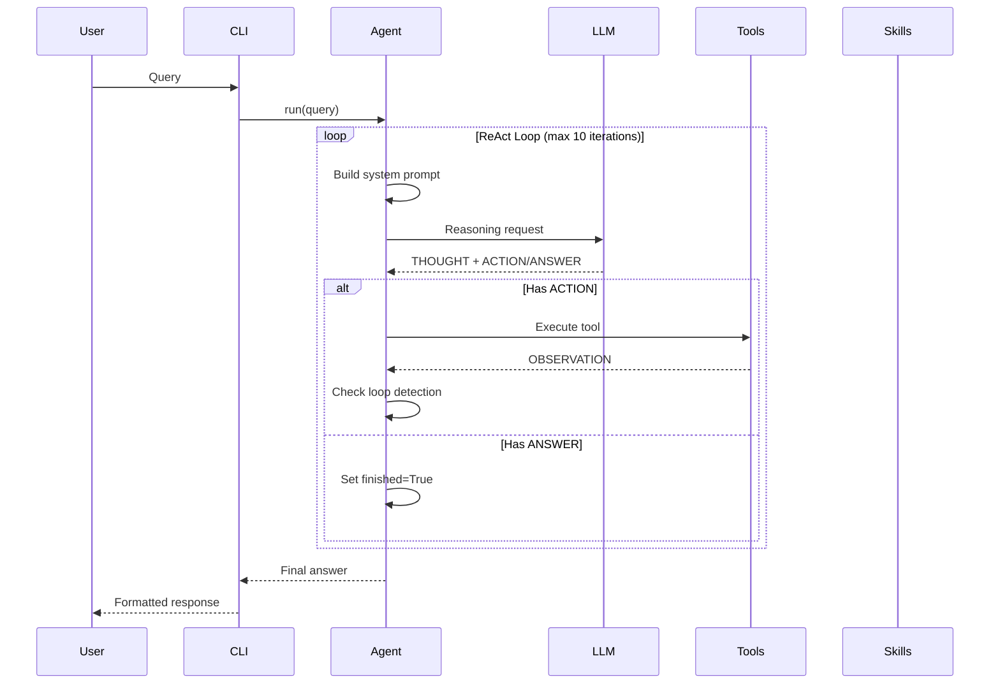
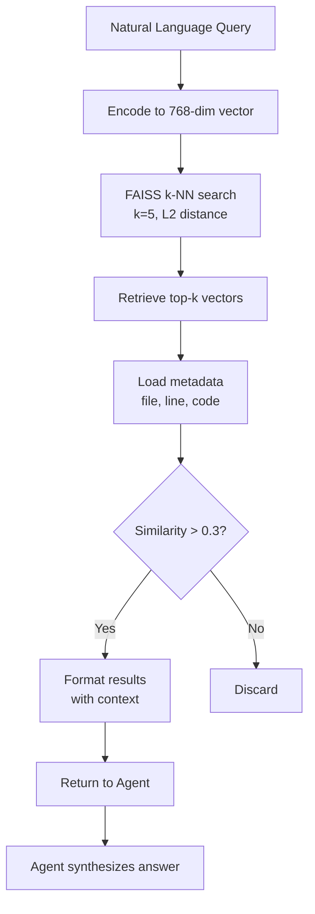
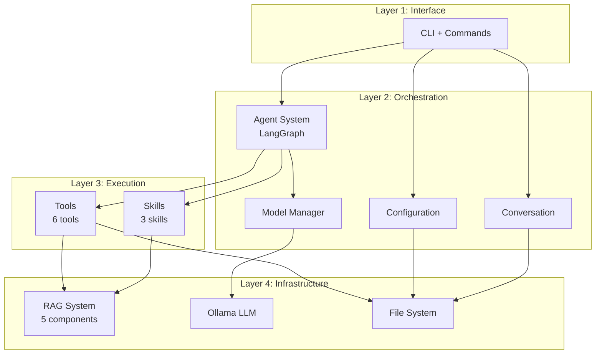
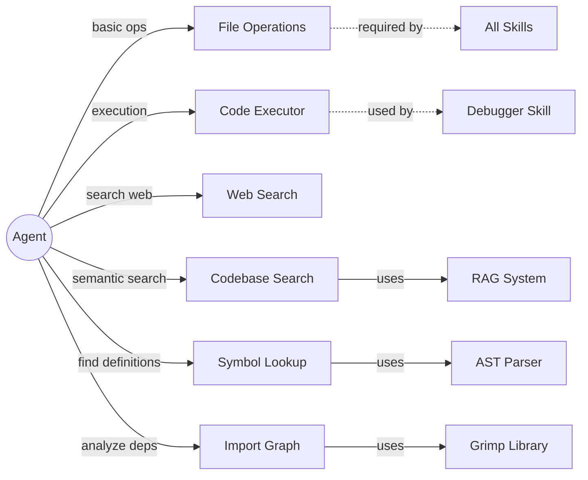
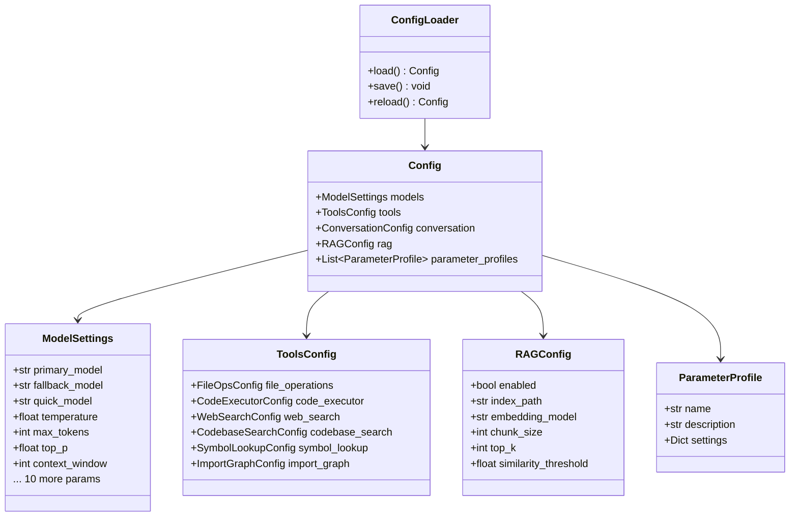
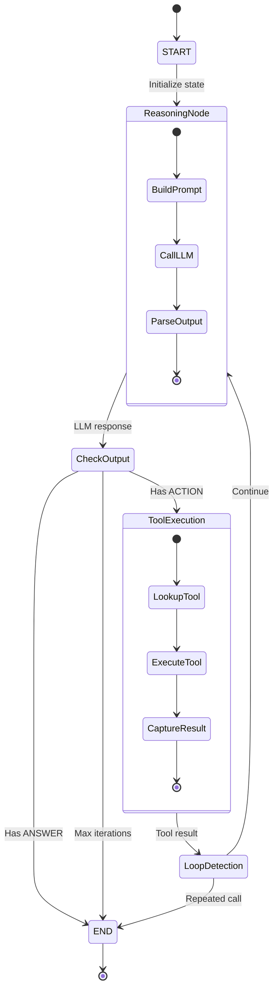
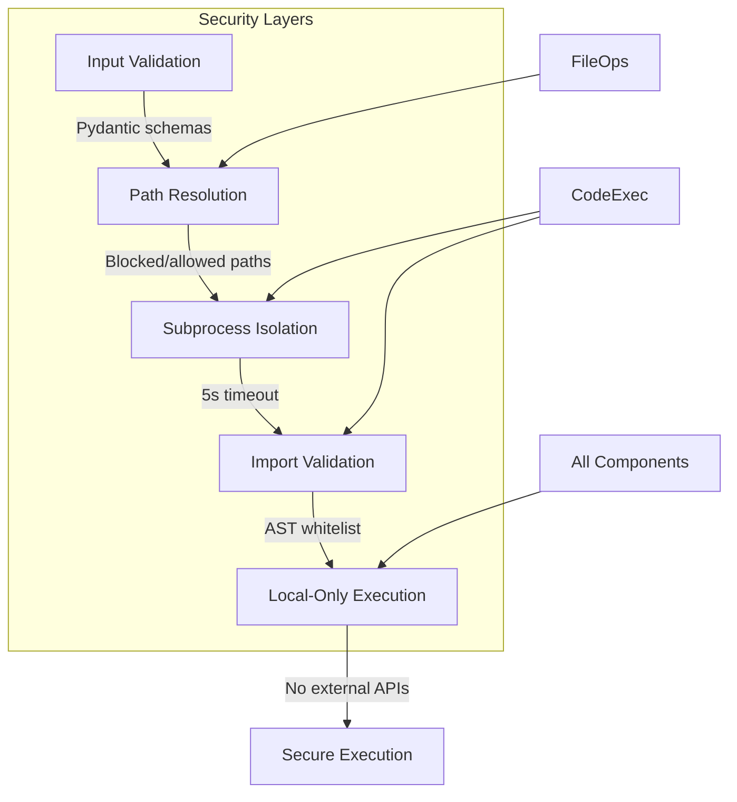

# Meton Software Architecture Diagram

## High-Level System Architecture

```mermaid
graph TB
    subgraph "User Interface Layer"
        CLI[CLI Interface<br/>cli.py]
        Commands[Commands<br/>/model, /web, /index, etc.]
    end

    subgraph "Core Components"
        Agent[Agent System<br/>LangGraph ReAct]
        Models[Model Manager<br/>Ollama Integration]
        Config[Configuration<br/>Pydantic + YAML]
        Conv[Conversation Manager<br/>Thread-safe Storage]
    end

    subgraph "Tools Layer"
        FileOps[File Operations<br/>read/write/list]
        CodeExec[Code Executor<br/>subprocess isolation]
        WebSearch[Web Search<br/>DuckDuckGo]
        CodebaseSearch[Codebase Search<br/>RAG semantic search]
        SymbolLookup[Symbol Lookup<br/>AST-based definitions]
        ImportGraph[Import Graph<br/>dependency analysis]
    end

    subgraph "Skills Layer"
        CodeExplainer[Code Explainer<br/>intelligent explanations]
        Debugger[Debugger Assistant<br/>debug guidance]
        Refactoring[Refactoring Engine<br/>code improvements]
    end

    subgraph "RAG System"
        CodeParser[Code Parser<br/>AST extraction]
        Chunker[Code Chunker<br/>semantic chunks]
        Embeddings[Embedding Model<br/>sentence-transformers]
        VectorStore[Vector Store<br/>FAISS]
        MetadataStore[Metadata Store<br/>JSON]
        Indexer[Codebase Indexer<br/>orchestration]
    end

    subgraph "External Systems"
        Ollama[Ollama<br/>Local LLM Server]
        FileSystem[File System<br/>conversations, config]
    end

    %% User Interface connections
    CLI --> Agent
    Commands --> Config
    Commands --> Conv
    CLI --> Models

    %% Agent connections
    Agent --> Models
    Agent --> Config
    Agent --> FileOps
    Agent --> CodeExec
    Agent --> WebSearch
    Agent --> CodebaseSearch
    Agent --> SymbolLookup
    Agent --> ImportGraph

    %% Skills connections
    Agent -.-> CodeExplainer
    Agent -.-> Debugger
    Agent -.-> Refactoring
    CodeExplainer --> FileOps
    Debugger --> FileOps
    Debugger --> CodeExec
    Refactoring --> FileOps

    %% RAG connections
    Indexer --> CodeParser
    Indexer --> Chunker
    Indexer --> Embeddings
    Indexer --> VectorStore
    Indexer --> MetadataStore
    CodebaseSearch --> VectorStore
    CodebaseSearch --> MetadataStore
    CodebaseSearch --> Embeddings

    %% External connections
    Models --> Ollama
    Conv --> FileSystem
    Config --> FileSystem
    MetadataStore --> FileSystem

    %% Styling
    classDef coreClass fill:#4A90E2,stroke:#2E5C8A,color:#fff
    classDef toolClass fill:#50C878,stroke:#2E7D4E,color:#fff
    classDef skillClass fill:#9B59B6,stroke:#6C3483,color:#fff
    classDef ragClass fill:#E67E22,stroke:#A04000,color:#fff
    classDef externalClass fill:#95A5A6,stroke:#5D6D7E,color:#fff
    classDef uiClass fill:#F39C12,stroke:#B9770E,color:#fff

    class Agent,Models,Config,Conv coreClass
    class FileOps,CodeExec,WebSearch,CodebaseSearch,SymbolLookup,ImportGraph toolClass
    class CodeExplainer,Debugger,Refactoring skillClass
    class CodeParser,Chunker,Embeddings,VectorStore,MetadataStore,Indexer ragClass
    class Ollama,FileSystem externalClass
    class CLI,Commands uiClass
```



## Agent Execution Flow



## RAG Indexing Flow

```mermaid
flowchart LR
    Start[User: /index path] --> Walk[Walk Directory Tree]
    Walk --> Filter{Filter Files}
    Filter -->|.py files| Parse[AST Parse]
    Filter -->|Skip| Skip[__pycache__, .git, venv]

    Parse --> Extract[Extract Functions<br/>Classes, Imports]
    Extract --> Chunk[Create Semantic Chunks<br/>1 per function/class]
    Chunk --> Batch[Batch Chunks]
    Batch --> Embed[Generate Embeddings<br/>768-dim vectors]
    Embed --> Store[Store in FAISS<br/>IndexFlatL2]
    Store --> Meta[Save Metadata<br/>file:line mappings]
    Meta --> ConfigUpdate[Update config.yaml<br/>enable RAG]
    ConfigUpdate --> Done[Index Complete]
```



## RAG Query Flow



## Component Interaction Layers



## Tool Dependency Graph



## Configuration System



## State Management in Agent



## Key Design Patterns

### 1. ReAct Pattern (Reasoning + Acting)

```text
THOUGHT → ACTION → OBSERVATION → THOUGHT → ... → ANSWER
```

### 2. Tool Pattern

```text
User Query → Agent → Tool Selection → Tool Execution → Result Integration
```

### 3. RAG Pattern

```text
Index: Code → Parse → Chunk → Embed → Store
Query: Question → Embed → Search → Retrieve → Synthesize
```

### 4. Loop Detection

```text
Track: (tool_name, input) pairs
Detect: If current == last, force completion
```

### 5. Configuration Persistence

```text
Runtime Change → Update Memory → Save to Disk → Reload on Restart
```

## Technology Stack

| Layer | Technologies |
|-------|-------------|
| **LLM** | Ollama (Qwen 2.5 32B, Llama 3.1 8B, Mistral) |
| **Agent Framework** | LangGraph (StateGraph, ReAct pattern) |
| **Embeddings** | sentence-transformers (all-mpnet-base-v2) |
| **Vector Store** | FAISS (IndexFlatL2) |
| **AST Parsing** | Python `ast` module |
| **Import Analysis** | grimp + NetworkX |
| **Web Search** | ddgs (DuckDuckGo) |
| **Config** | Pydantic + PyYAML |
| **CLI** | Rich (formatting and display) |
| **Storage** | JSON (conversations, metadata) |
| **Execution** | subprocess (isolated code execution) |

## Security Architecture



## Performance Optimizations

1. **LLM Caching**: Models cached per-name to avoid recreation
2. **Lazy Loading**: RAG indexer loaded only when needed
3. **Batch Embeddings**: Process chunks in batches (32)
4. **Symbol Lookup Cache**: 60-second TTL for symbol index
5. **Conversation Trimming**: Auto-trim to max_history (20)
6. **Context Window**: 32K tokens for large file support
7. **FAISS**: Exact L2 distance (fast, no approximation)

## Extension Points

| Extension Type | Base Class | Location |
|---------------|------------|----------|
| **New Tool** | `MetonBaseTool` | `tools/base.py` |
| **New Skill** | `BaseSkill` | `skills/base.py` |
| **New Command** | N/A (function in CLI) | `cli.py` |
| **New Config** | `BaseModel` (Pydantic) | `core/config.py` |
| **New Model** | N/A (Ollama integration) | `core/models.py` |

## Data Flow Summary

```text
┌─────────────────────────────────────────────────────────────┐
│                         User Input                           │
└────────────────────────┬────────────────────────────────────┘
                         │
                         ▼
┌─────────────────────────────────────────────────────────────┐
│                    CLI Processing                            │
│  • Parse command/query                                       │
│  • Route to handler                                          │
└────────────────────────┬────────────────────────────────────┘
                         │
                         ▼
┌─────────────────────────────────────────────────────────────┐
│                    Agent System                              │
│  • Build system prompt (path + tools + examples)             │
│  • ReAct loop (max 10 iterations)                            │
│  • Loop detection                                            │
└────────────┬───────────────────────────┬────────────────────┘
             │                           │
             ▼                           ▼
┌─────────────────────────┐   ┌──────────────────────────────┐
│    Tool Execution       │   │    Skill Execution           │
│  • File operations      │   │  • Code explainer            │
│  • Code execution       │   │  • Debugger                  │
│  • Web search           │   │  • Refactoring               │
│  • Codebase search      │   │                              │
│  • Symbol lookup        │   │                              │
│  • Import analysis      │   │                              │
└────────────┬────────────┘   └──────────────┬───────────────┘
             │                               │
             │         ┌─────────────────────┘
             │         │
             ▼         ▼
┌─────────────────────────────────────────────────────────────┐
│                    LLM (via Ollama)                          │
│  • Generate reasoning                                        │
│  • Select actions                                            │
│  • Synthesize answers                                        │
└────────────────────────┬────────────────────────────────────┘
                         │
                         ▼
┌─────────────────────────────────────────────────────────────┐
│                 Response Formatting                          │
│  • Rich console output                                       │
│  • Code highlighting                                         │
│  • Tables and panels                                         │
└────────────────────────┬────────────────────────────────────┘
                         │
                         ▼
┌─────────────────────────────────────────────────────────────┐
│                    User Output                               │
└─────────────────────────────────────────────────────────────┘
```

## File Reference Map

```text
Core System
├── meton.py ........................... Entry point
├── cli.py ............................. Main CLI interface
├── config.yaml ........................ Configuration
├── core/
│   ├── agent.py ....................... LangGraph ReAct agent
│   ├── config.py ...................... Pydantic configuration
│   ├── models.py ...................... Ollama model manager
│   └── conversation.py ................ Conversation manager

Tools & Skills
├── tools/
│   ├── base.py ........................ MetonBaseTool base class
│   ├── file_ops.py .................... File operations
│   ├── code_executor.py ............... Code execution
│   ├── web_search.py .................. Web search (ddgs)
│   ├── codebase_search.py ............. RAG semantic search
│   ├── symbol_lookup.py ............... AST symbol definitions
│   └── import_graph.py ................ Import dependency analysis
├── skills/
│   ├── base.py ........................ BaseSkill abstract class
│   ├── code_explainer.py .............. Code explanation
│   ├── debugger.py .................... Debug assistance
│   └── refactoring_engine.py .......... Code refactoring

RAG System
├── rag/
│   ├── code_parser.py ................. AST-based parsing
│   ├── chunker.py ..................... Semantic chunking
│   ├── embeddings.py .................. Sentence transformers
│   ├── vector_store.py ................ FAISS vector store
│   ├── metadata_store.py .............. JSON metadata storage
│   └── indexer.py ..................... Indexing orchestration

Utilities & Documentation
├── utils/
│   ├── logger.py ...................... Logging setup
│   ├── formatting.py .................. CLI formatting
│   └── prepare_training_data.py ....... Fine-tuning data prep
├── docs/
│   ├── ARCHITECTURE.md ................ Detailed architecture
│   ├── STATUS.md ...................... Development status
│   ├── QUICK_REFERENCE.md ............. Command cheat sheet
│   └── FINE_TUNING.md ................. Fine-tuning guide
└── templates/
    └── modelfiles/ .................... Ollama Modelfile templates
```
